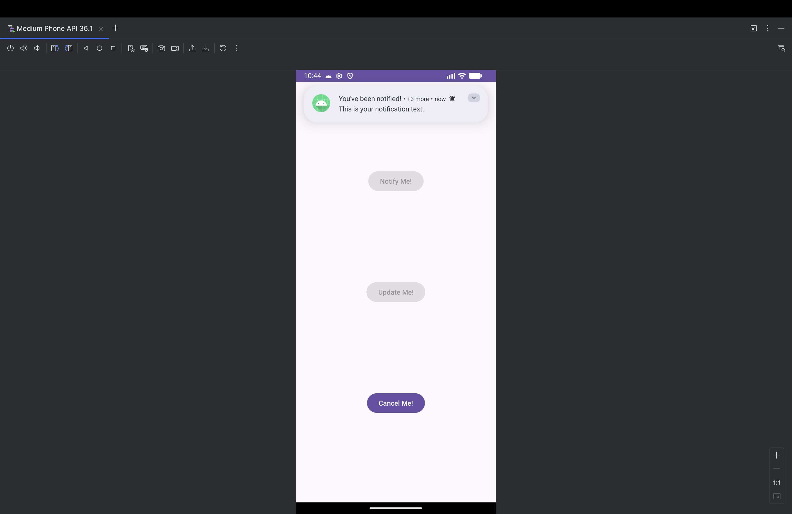
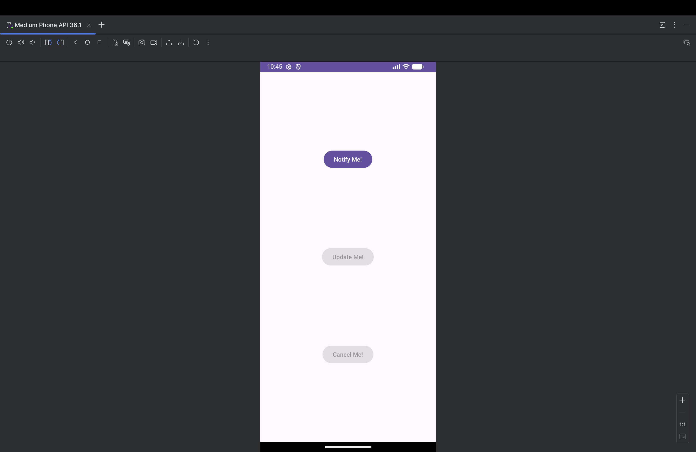

# NotifyMe

An Android app (Java) that demonstrates Android notifications: posting, updating and cancelling a notification from buttons on the main screen, with button states that change to match.

## Running it

Open the folder in Android Studio and run the `app` configuration on an emulator or device.

## Project layout

- `app/src/main/java/com/example/notifyme/MainActivity.java` — notification logic
- `app/src/main/res/` — layouts, icons and images
- `docs/` — enhancement write-up and screenshots

## Screenshots

| Main screen | Notification | Button states | Cancel |
|---|---|---|---|
|  |  |  |  |
